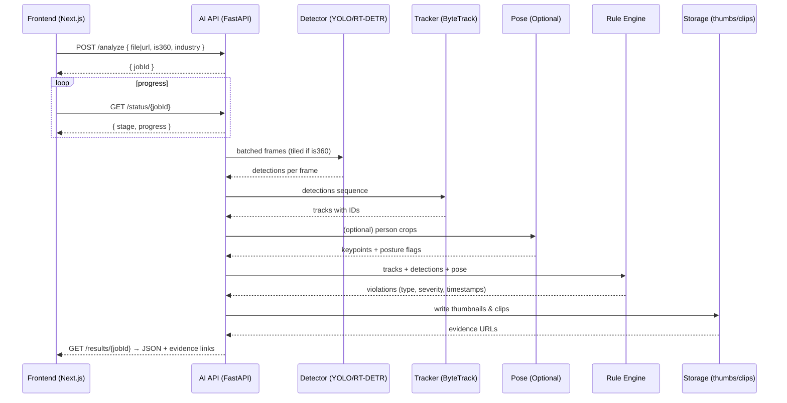

# Factory Compliance Assistant — Workflow

This document explains the end-to-end workflow for AI-powered compliance analysis, shows how each frontend feature is achieved, and clearly calls out what is feasible now vs. what needs additional work or is not feasible with the current workflow.

---

## 1) High-Level Flow (Batch video — standard and 360°)

```mermaid
flowchart LR
  U[User uploads video (MP4/MOV/AVI or 360°)] --> A[Create analysis job]
  A -->|/analyze| Q[Job Queue]
  Q --> S[AI Inference Service]
  S --> P[Preprocess]
  P --> D[Detect (YOLO / RT-DETR)]
  D --> T[Track (ByteTrack)]
  T --> O[Optional Pose (RTMPose/MediaPipe)]
  O --> R[Rule Engine]
  R --> E[Evidence (thumbs & clips)]
  E --> J[Results JSON]
  J -->|/results/{jobId}| FE[Next.js Dashboard]
  J -->|/status/{jobId}| FE
```

Key points:
- Handles both standard and 360° videos. 360° frames are tiled with overlap, detected per tile, and merged back to global coordinates.
- Async job pattern: frontend polls `/status/{jobId}` and fetches `/results/{jobId}` when complete.

---

## 2) Component Flow (AI Inference Service)



---

## 3) Frontend Feature → How It’s Achieved

- **Upload** (`/video-upload`)
  - Accepts MP4/MOV/AVI and flags 360° videos.
  - Calls `POST /analyze` with `{ is360, industry, file|url }`.

- **Processing** (`/processing`)
  - Polls `GET /status/{jobId}`.
  - Stages reported by backend: `preprocess → detect → track → rules → report`.
  - Progress (0–100) computed server-side; streamed as SSE/WebSocket or simple polling.

- **Results** (`/results`)
  - Fetches `GET /results/{jobId}`.
  - Overlays: Uses `bboxPct: [x,y,w,h]` (percentages) so boxes scale correctly with responsive player.
  - Timeline: Uses `timeline[]` markers with `timestampSec` and `severity`.
  - Thumbnails/Clips: Displays `evidence.thumbUrl` and `evidence.clipUrl` for each violation.

- **Report** (`/report`)
  - Renders `overallScore` + violation breakdown + evidence links.
  - Exports: PDF/CSV generated client-side or requested from API as pre-rendered assets.

- **Industry Packs** (`/industry-pack`)
  - Frontend selects industry; passes value to `/analyze`.
  - Backend activates rule sets accordingly (foundation + specialization of chosen industry).

---

## 4) Minimal, Clear API (Contract)

- **POST** `/analyze`
  - **Request**: `{ videoUrl? string, file? multipart, is360: boolean, industry: 'general'|'pharma'|'food'|'electronics'|'chemicals'|'auto' }`
  - **Response**: `{ jobId: string }`

- **GET** `/status/{jobId}`
  - **Response**: `{ stage: 'preprocess'|'detect'|'track'|'rules'|'report'|'done'|'error', progress: number, message?: string }`

- **GET** `/results/{jobId}`
  - **Response**:
    ```json
    {
      "overallScore": 94.5,
      "meta": { "fps": 30, "width": 1920, "height": 1080, "is360": false, "modelVersion": "yolov8s-2025-09" },
      "violations": [
        {
          "id": "V-001",
          "type": "missing_helmet",
          "severity": "major",
          "timestampSec": 42.1,
          "bboxPct": [0.32, 0.18, 0.12, 0.22],
          "trackId": 7,
          "confidence": 0.91,
          "evidence": { "thumbUrl": "/evidence/V-001.jpg", "clipUrl": "/clips/V-001.mp4" }
        }
      ],
      "timeline": [ { "timestampSec": 42.1, "markers": [ { "type": "missing_helmet", "severity": "major" } ] } ],
      "detectionsSample": [
        { "frameIdx": 105, "timestampSec": 42.0, "items": [ { "class": "person", "conf": 0.97, "bboxPct": [0.31,0.17,0.14,0.24], "trackId": 7 } ] }
      ]
    }
    ```

**Notes:**
- Percent-based boxes ensure overlay correctness in responsive UI.
- Evidence URLs plug directly into Results and Report pages.

---

## 5) 360° Video Handling (Feasible & Clear)

- Input format: equirectangular (width:height ≈ 2:1).
- Tiling: split horizontally into 6–8 overlapping tiles; project per-tile to planar; detect; map back; merge duplicates on seams by IoU+class.
- Same tracking/rules pipeline after merge; return global `bboxPct`.

---

## 6) What Exists Today vs. What’s Needed

Current repository (`compliance_analysis_notebook.ipynb`) already demonstrates:
- Video I/O, sampling, basic detection (YOLOv8), pose estimation (MediaPipe), simple rule evaluation, and scoring.
- Outputs and visuals that align with your dashboard overlays and scoring.

Additions needed to power the dashboard end-to-end:
- A production AI inference service (FastAPI) implementing the pipeline and the API above.
- Model export and optimization (ONNX/TensorRT) for speed; ByteTrack for tracking.
- Evidence generation (thumbs/clips) and storage layer.
- 360° tiling + merge module.
- Async job orchestration and progress reporting.

---

## 7) Feasibility Matrix (Concise)

| Frontend Claim/Feature | Status with This Workflow |
|---|---|
| Analyze standard MP4 walkthroughs | Feasible now (detector + tracker + rules) |
| Analyze 360° equirectangular videos | Feasible with tiling+merge module |
| PPE detection (helmet, vest, gloves) | Feasible with targeted fine-tuning |
| Exit blockage / obstruction | Feasible with detection + zone masks |
| Ergonomic posture flags | Feasible (pose on person tracks) |
| Evidence thumbnails and clips | Feasible (server-side FFmpeg) |
| Interactive timeline with jump-to | Feasible (based on timestamps) |
| Severity-weighted scoring | Feasible (backend mirrors dashboard logic) |
| Multi-industry rule packs | Feasible (activate per `industry`) |
| Real-time streaming analysis | Not in current workflow; requires stream ingest & low-latency optimizations |
| OCR-based label/sign validation | Not covered here; add OCR (Tesseract/PP-OCR) if required |
| Full scene 3D reconstruction | Out of scope; not required for MVP |

---

## 8) Known Gaps / Not Feasible (as-is)

- True real-time streaming alerts (sub-second) — current plan is batch/near-real-time per video job.
- Advanced OCR for inspection tags/labels — separate OCR pipeline not included yet.
- Complex environment physics or 3D mapping — not required for walkthrough video compliance.
- Predictive analytics — can be added later once historical data accumulates.

---

## 9) Minimal Viable Scope (Recommended)

- Detector classes: `person, helmet, vest, gloves, obstruction, exit_sign, fire_extinguisher, spill`.
- Tracking: ByteTrack on `person`.
- Rules: missing PPE in zones; blocked exits/walkways; basic spills.
- 360°: tiling+merge implementation.
- Evidence: thumbnail + 10s clip per violation.
- API: `/analyze`, `/status/{jobId}`, `/results/{jobId}`.

This scope is unique, scalable, and effective while remaining feasible.

---

## 10) References to This Repo

- Notebook: `compliance_analysis_notebook.ipynb` (prototype pipeline and visuals)
- Outputs: `outputs/` (evidence/reports directory structure you can mirror)
- Rules/SOPs: `rules/`, `sops/` (seed content for the rule engine)

This workflow keeps your dashboard intact and adds a clear, feasible AI backend that supports both standard and 360° videos with a concrete, minimal API. 