# Japan AI Model - Compliance Analysis Pipeline Workflow

This document explains the actual implementation workflow for the AI-powered compliance analysis pipeline, based on the current Jupyter notebook implementation.

---

## 1) Actual System Architecture

The current implementation is a **Jupyter notebook-based analysis pipeline** that processes video files locally:

```
Input Video (MP4/360°) 
    ↓
Video Preprocessing & Frame Sampling
    ↓  
Object Detection (YOLOv8)
    ↓
Tracking & Pose Estimation
    ↓
Rule Engine (Industry-Specific)
    ↓
Evidence Generation (Clips/Screenshots)
    ↓
Compliance Scoring
    ↓
Report Generation (PDF/CSV)
    ↓
Interactive Dashboard (Streamlit)
```

## 2) Current Implementation Details

### Video Input & Preprocessing
- **Supported formats**: MP4, MOV, AVI (standard and 360° equirectangular)
- **360° Processing**: Converts equirectangular to perspective tiles using mathematical reprojection
- **Frame sampling**: Configurable FPS (default 2 FPS for efficiency)
- **Privacy**: Optional face blurring for compliance

### Detection & Analysis
- **Object Detection**: YOLOv8 (configurable models: yolov8n.pt to yolov8x.pt)
- **Tracking**: DeepSort for person tracking across frames
- **Pose Estimation**: MediaPipe for ergonomic analysis
- **OCR**: Tesseract for text detection (signs, labels)

### Rule Engine
- **Industry Packs**: Manufacturing, Food Processing, Chemical, General
- **Rule Types**: PPE detection, zone compliance, emergency access, ergonomics
- **Temporal Logic**: Persistence thresholds and confidence scoring
- **Configurable Weights**: Critical, Major, Minor, Warning severities

### Output Generation
- **Evidence**: Automatic clip extraction (±3s around violations)
- **Reports**: PDF compliance reports with scoring breakdown
- **Data Export**: CSV files with violation details
- **Dashboard**: Interactive Streamlit interface for visualization

## 3) How to Use the Current System

### Step 1: Setup
```bash
# Install dependencies
pip install -r requirements.txt

# Test the pipeline
python test_pipeline.py
```

### Step 2: Video Analysis
```bash
# Open Jupyter notebook
jupyter notebook compliance_analysis_notebook.ipynb

# Configure in Cell 2:
VIDEO_PATH = 'data/your-video.mp4'
INDUSTRY_PACK = 'manufacturing'  # or 'food', 'chemical', 'general'
```

### Step 3: Run Analysis
Execute cells sequentially:
1. **Cell 1**: Library setup and imports
2. **Cell 2**: Configuration (video path, industry pack, parameters)
3. **Cell 3**: Video preprocessing and frame sampling
4. **Cell 4**: 360° reprojection (if applicable)
5. **Cell 5-8**: Object detection and tracking
6. **Cell 9-10**: Pose estimation and OCR
7. **Cell 11-12**: Rule engine evaluation
8. **Cell 13-14**: Compliance scoring
9. **Cell 15**: Report generation
10. **Cell 16**: Dashboard creation

### Step 4: Review Results
```bash
# Generated outputs in:
outputs/reports/compliance_report.pdf    # PDF report
outputs/reports/violations.csv          # Violation details
outputs/scorecard.json                  # Scoring data
outputs/evidence/                       # Screenshots
outputs/clips/                          # Video clips
outputs/compliance_dashboard.py         # Streamlit app

# Launch interactive dashboard
streamlit run outputs/compliance_dashboard.py
```

## 4) Configuration Options

### Industry Pack Settings
```python
INDUSTRY_PACK = 'manufacturing'  # Options:
# - 'food': Hairnet, gloves, temperature compliance
# - 'manufacturing': PPE, safety equipment, workstation
# - 'chemical': Protective equipment, spill detection
# - 'general': Emergency exits, basic safety protocols
```

### Performance Settings
```python
SAMPLE_FPS = 2                    # Frames per second to analyze
CONFIDENCE_THRESHOLD = 0.45       # Detection confidence
DETECTOR_MODEL = 'yolov8n.pt'     # Model size (n/s/m/l/x)
FRAME_SKIP = 30                   # Skip frames for demo speed
```

### 360° Video Settings
```python
ENABLE_360_PROCESSING = True      # Enable 360° processing
N_TILES_360 = 4                   # Number of perspective views
TILE_FOV = 90                     # Field of view per tile
```

## 5) What Works vs What's Planned

### ✅ Currently Implemented
- Local video file processing (MP4, 360°)
- YOLOv8 object detection with tracking
- Industry-specific rule evaluation
- Evidence clip and screenshot generation
- PDF report generation with scoring
- Interactive Streamlit dashboard
- 360° equirectangular video support
- Configurable industry compliance packs

### 🚧 Demo Limitations
- **Mock detections**: Uses pre-trained YOLO models (not factory-trained)
- **Batch processing only**: No real-time streaming
- **Local execution**: No web API or cloud deployment
- **Limited OCR**: Basic text detection without specialized training

### 📋 Future Development Needed
- **Production API**: REST endpoints for remote processing
- **Real-time streaming**: Live video analysis capability
- **Custom model training**: Factory-specific detection models
- **Cloud deployment**: Scalable infrastructure
- **Advanced OCR**: Specialized text recognition for industrial signs
- **Database integration**: Historical data storage and analytics

## 6) Key Files and Structure

```
compliance-analysis-pipeline/
├── compliance_analysis_notebook.ipynb  # Main analysis pipeline
├── test_pipeline.py                    # Quick test script
├── requirements.txt                    # Python dependencies
├── data/                               # Input video files
│   └── ssvid.net--Toyota-VR-360-Factory-Tour_v720P.mp4
├── outputs/                            # Generated results
│   ├── reports/                        # PDF and CSV reports
│   ├── evidence/                       # Screenshots
│   ├── clips/                          # Video clips
│   └── compliance_dashboard.py         # Streamlit app
├── rules/                              # Industry rule templates
├── sops/                               # Sample SOP documents
└── templates/                          # Report templates
```

## 7) Performance and Accuracy

### Current Performance
- **Processing Speed**: ~2-5 minutes per minute of video (depends on hardware)
- **Memory Usage**: ~2-4GB RAM for typical videos
- **Model Size**: 6MB (yolov8n) to 136MB (yolov8x)

### Accuracy Expectations
- **Demo Mode**: Illustrative detections using pre-trained models
- **Production Requirements**: Custom training needed for factory-specific accuracy
- **Rule Engine**: Configurable confidence thresholds and temporal persistence

## 8) Technical Architecture

### Core Components
1. **Video Processor**: OpenCV-based frame extraction and 360° reprojection
2. **Detection Engine**: YOLOv8 with DeepSort tracking
3. **Rule Evaluator**: Industry-specific compliance logic
4. **Evidence Generator**: FFmpeg-based clip extraction
5. **Scoring System**: Weighted violation assessment
6. **Report Builder**: ReportLab PDF generation
7. **Dashboard**: Streamlit interactive interface

### Dependencies
- **Computer Vision**: OpenCV, Ultralytics YOLOv8
- **Tracking**: DeepSort, MediaPipe
- **Reports**: ReportLab, Matplotlib, Plotly
- **Dashboard**: Streamlit, Pandas
- **OCR**: Tesseract, PyTesseract

---

## Quick Start Summary

1. **Install**: `pip install -r requirements.txt`
2. **Test**: `python test_pipeline.py`  
3. **Configure**: Update video path and industry pack in notebook Cell 2
4. **Run**: Execute all notebook cells sequentially
5. **Review**: Check `outputs/` directory for results
6. **Dashboard**: `streamlit run outputs/compliance_dashboard.py`

This workflow reflects the **actual current implementation** - a comprehensive Jupyter notebook pipeline for compliance analysis of factory videos.

## 2) Component Flow (AI Inference Service)

```mermaid
sequenceDiagram
  participant FE as Frontend (Next.js)
  participant API as AI API (FastAPI)
  participant DET as Detector (YOLO/RT-DETR)
  participant TRK as Tracker (ByteTrack)
  participant POS as Pose (Optional)
  participant RL as Rule Engine
  participant ST as Storage (thumbs/clips)

  FE->>API: POST /analyze { file|url, is360, industry }
  API-->>FE: { jobId }
  loop progress
    FE->>API: GET /status/{jobId}
    API-->>FE: { stage, progress }
  end
  API->>DET: batched frames (tiled if is360)
  DET-->>API: detections per frame
  API->>TRK: detections sequence
  TRK-->>API: tracks with IDs
  API->>POS: (optional) person crops
  POS-->>API: keypoints + posture flags
  API->>RL: tracks + detections + pose
  RL-->>API: violations (type, severity, timestamps)
  API->>ST: write thumbnails & clips
  ST-->>API: evidence URLs
  API-->>FE: GET /results/{jobId} → JSON + evidence links
```



---

## 3) Frontend Feature → How It’s Achieved

- **Upload** (`/video-upload`)
  - Accepts MP4/MOV/AVI and flags 360° videos.
  - Calls `POST /analyze` with `{ is360, industry, file|url }`.

- **Processing** (`/processing`)
  - Polls `GET /status/{jobId}`.
  - Stages reported by backend: `preprocess → detect → track → rules → report`.
  - Progress (0–100) computed server-side; streamed as SSE/WebSocket or simple polling.

- **Results** (`/results`)
  - Fetches `GET /results/{jobId}`.
  - Overlays: Uses `bboxPct: [x,y,w,h]` (percentages) so boxes scale correctly with responsive player.
  - Timeline: Uses `timeline[]` markers with `timestampSec` and `severity`.
  - Thumbnails/Clips: Displays `evidence.thumbUrl` and `evidence.clipUrl` for each violation.

- **Report** (`/report`)
  - Renders `overallScore` + violation breakdown + evidence links.
  - Exports: PDF/CSV generated client-side or requested from API as pre-rendered assets.

- **Industry Packs** (`/industry-pack`)
  - Frontend selects industry; passes value to `/analyze`.
  - Backend activates rule sets accordingly (foundation + specialization of chosen industry).

---

## 4) Minimal, Clear API (Contract)

- **POST** `/analyze`
  - **Request**: `{ videoUrl? string, file? multipart, is360: boolean, industry: 'general'|'pharma'|'food'|'electronics'|'chemicals'|'auto' }`
  - **Response**: `{ jobId: string }`

- **GET** `/status/{jobId}`
  - **Response**: `{ stage: 'preprocess'|'detect'|'track'|'rules'|'report'|'done'|'error', progress: number, message?: string }`

- **GET** `/results/{jobId}`
  - **Response**:
    ```json
    {
      "overallScore": 94.5,
      "meta": { "fps": 30, "width": 1920, "height": 1080, "is360": false, "modelVersion": "yolov8s-2025-09" },
      "violations": [
        {
          "id": "V-001",
          "type": "missing_helmet",
          "severity": "major",
          "timestampSec": 42.1,
          "bboxPct": [0.32, 0.18, 0.12, 0.22],
          "trackId": 7,
          "confidence": 0.91,
          "evidence": { "thumbUrl": "/evidence/V-001.jpg", "clipUrl": "/clips/V-001.mp4" }
        }
      ],
      "timeline": [ { "timestampSec": 42.1, "markers": [ { "type": "missing_helmet", "severity": "major" } ] } ],
      "detectionsSample": [
        { "frameIdx": 105, "timestampSec": 42.0, "items": [ { "class": "person", "conf": 0.97, "bboxPct": [0.31,0.17,0.14,0.24], "trackId": 7 } ] }
      ]
    }
    ```

**Notes:**
- Percent-based boxes ensure overlay correctness in responsive UI.
- Evidence URLs plug directly into Results and Report pages.

---

## 5) 360° Video Handling (Feasible & Clear)

- Input format: equirectangular (width:height ≈ 2:1).
- Tiling: split horizontally into 6–8 overlapping tiles; project per-tile to planar; detect; map back; merge duplicates on seams by IoU+class.
- Same tracking/rules pipeline after merge; return global `bboxPct`.

---

## 6) What Exists Today vs. What’s Needed

Current repository (`compliance_analysis_notebook.ipynb`) already demonstrates:
- Video I/O, sampling, basic detection (YOLOv8), pose estimation (MediaPipe), simple rule evaluation, and scoring.
- Outputs and visuals that align with your dashboard overlays and scoring.

Additions needed to power the dashboard end-to-end:
- A production AI inference service (FastAPI) implementing the pipeline and the API above.
- Model export and optimization (ONNX/TensorRT) for speed; ByteTrack for tracking.
- Evidence generation (thumbs/clips) and storage layer.
- 360° tiling + merge module.
- Async job orchestration and progress reporting.

---

## 7) Feasibility Matrix (Concise)

| Frontend Claim/Feature | Status with This Workflow |
|---|---|
| Analyze standard MP4 walkthroughs | Feasible now (detector + tracker + rules) |
| Analyze 360° equirectangular videos | Feasible with tiling+merge module |
| PPE detection (helmet, vest, gloves) | Feasible with targeted fine-tuning |
| Exit blockage / obstruction | Feasible with detection + zone masks |
| Ergonomic posture flags | Feasible (pose on person tracks) |
| Evidence thumbnails and clips | Feasible (server-side FFmpeg) |
| Interactive timeline with jump-to | Feasible (based on timestamps) |
| Severity-weighted scoring | Feasible (backend mirrors dashboard logic) |
| Multi-industry rule packs | Feasible (activate per `industry`) |
| Real-time streaming analysis | Not in current workflow; requires stream ingest & low-latency optimizations |
| OCR-based label/sign validation | Not covered here; add OCR (Tesseract/PP-OCR) if required |
| Full scene 3D reconstruction | Out of scope; not required for MVP |

---

## 8) Known Gaps / Not Feasible (as-is)

- True real-time streaming alerts (sub-second) — current plan is batch/near-real-time per video job.
- Advanced OCR for inspection tags/labels — separate OCR pipeline not included yet.
- Complex environment physics or 3D mapping — not required for walkthrough video compliance.
- Predictive analytics — can be added later once historical data accumulates.

---

## 9) Minimal Viable Scope (Recommended)

- Detector classes: `person, helmet, vest, gloves, obstruction, exit_sign, fire_extinguisher, spill`.
- Tracking: ByteTrack on `person`.
- Rules: missing PPE in zones; blocked exits/walkways; basic spills.
- 360°: tiling+merge implementation.
- Evidence: thumbnail + 10s clip per violation.
- API: `/analyze`, `/status/{jobId}`, `/results/{jobId}`.

This scope is unique, scalable, and effective while remaining feasible.

---

## 10) References to This Repo

- Notebook: `compliance_analysis_notebook.ipynb` (prototype pipeline and visuals)
- Outputs: `outputs/` (evidence/reports directory structure you can mirror)
- Rules/SOPs: `rules/`, `sops/` (seed content for the rule engine)

This workflow keeps your dashboard intact and adds a clear, feasible AI backend that supports both standard and 360° videos with a concrete, minimal API. 